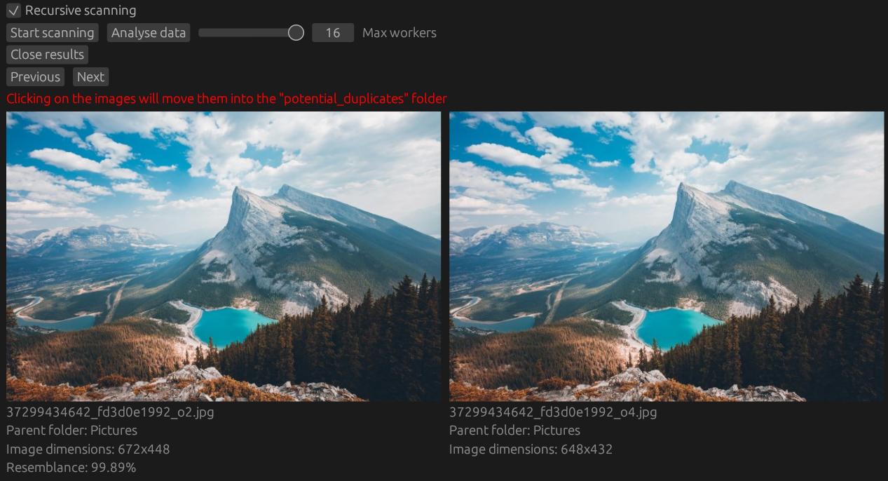

# Image duplicate finder

This tool can scan and analyses images in a given folder and allows the user to check if there are duplicates. The self-made algorithm used is dividing the images into `4x4` tiles and calculate the tile's average pixel value (brightness). The brightness levels of all images are then compared and a [correlation coefficient](https://en.wikipedia.org/wiki/Pearson_correlation_coefficient) is calculated for each pair. The user can select how many workers (threads) are used for the scanning and analysation steps. Since the number of image pairs grows quadratically, this work is divided into chunks to process the total work without exceeding system memory. Currently the chunk size is hardcoded and set to `5 million pairs`. The process may take up to `10GB` of ram during the analysis. The user may change this chunk size in the future to accommodate to their hardware limits.

The code still has some TODO markers, which are ideas for future improvements. The current state has only been tested by the author.

Selection of the duplicate can be done by clicking on the presented image.

## Features
* Finding similarities in images, even if they have different dimensions
* Detecting of black/white images and their coloured equivalents
* Simple UI, clicking on the image will move it to a "potential_duplicate" folder where they can be inspected
* Already selected duplicates will not be processed again
* Duplicate candidates are moved to a folder and are not deleted
* Undo actions to undo a move action

## Shortcomings
* May detect similar compositions as duplicates
* UI is lacking deletion functions for the database files
* Database files are plaintext files, each JSON lines (may change in the future).
* JPEG/PNG are supported, malformed image headers are ignored.
* Documentation is WIP

## Screenshots
Left side contains a down-scaled version if the right image.

Left side contains a version with changed brightness.

Right side contains a slightly cropped version.
